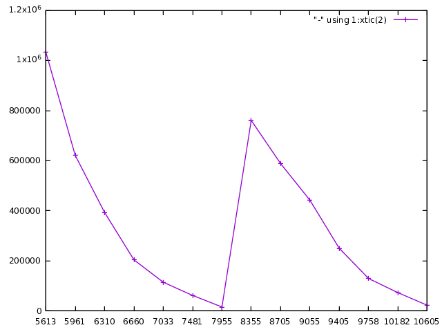
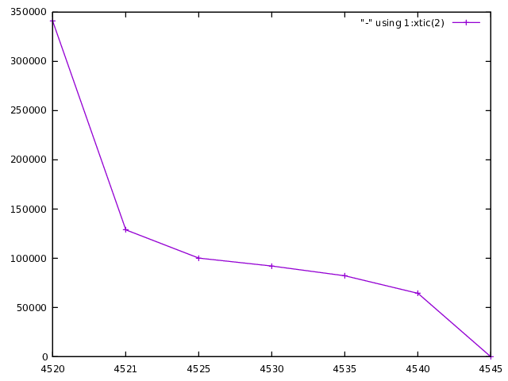
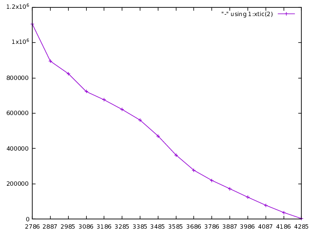

# Runtime analysis of differently scaled problems

## Setup

We run the [Calliope Euro Model](https://github.com/timtroendle/euro-calliope) without scaling (*unscaled*), with manual scaling (*scaled*) and with Gurobi's automatic scaling (*gurobi*), i.e. Gurobi ScaleFlag = 2.

## Results

The log outputs are separately linked for [*unscaled*](./analysis/unscaled.log), [*scaled*](./analysis/scaled.log) and [*gurobi*](./analysis/gurobiscaled.log). What follows is essentially an analysis of these files.

## Quick summary

It follows a summary of how much time was spent in which part of the optimization of the different instances of the model. This only considers time spent in the Gurobi backend. We run the model in each case on a time subset of 01.01. to 30.06.

|sec\\instance|	*unscaled*|	*scaled*|	*gurobi*|	
|---|---|---|---|
|Preprocess |	61 | 69 |	61 |
|Barrier | 5609 | 4517 | 2782 |
|DPushes | 5241 | 25 | 1515 |
|PPushes | 971 | 46 | 1388 |
|Simplex | 2020 | 870 | 1552 |

All times are given in seconds. 
- Preprocess entails everything Gurobi does before starting barrier, in particular removing redundant rows and cols in the constraint matrix (c.f. [seminal paper about lp preprocessing](https://link.springer.com/article/10.1007/BF01580428).
- Barrier is the application of the interior point method that finds an optimal point x. This point is not guaranteed to be a basic solution, on the contrary it is very likely to be a midface solution. To recover a basic solution with the optimal objective value next the crossover phase is started.
- First we want to find a square submatrix AB of the matrix A with full rank (a basis for A) such that the induced basic feasible solution xB = AB.inv (b - AN xN) is close to x (here AN is the complement of AB and xN the complement of xB. xN has all variables pushed to the bounds). For this we need to push some of the variables of x to their bounds. This happens in DPushes for the dual variables and in PPushes for the primal variables (why necessary for both? do we use primal-dual simplex for cleanup?).
- Lastly, we run a simplex starting from the "advanced basis" we just found to reoptimize xB.
In DPushes the dual variables are pushed to their bounds, i.e. 

## Observations

Caveat: what follows is derived from the log files and not directly visible in the above results
- *scaled* is considerably faster at finding a basis than the other two models!
- There is no model that is fastest in all parts of the algorithm.
- *unscaled* loses a lot of time because it needs to restart the crossover after about 2500s
- both *scaled* and *gurobi* need to tighten their Markowitz tolerance, *gurobi* to 0.5, *scaled* to 0.25

My best guess is that the runtime of the Barrier and the Simplex method cannot be consistently improved by scaling the problem (c.f. also [this paper](https://link.springer.com/article/10.1007/s10589-011-9420-4)) although the literature does not agree on this. However, it seems that the basis recovery phase of crossover (DPushes and PPushes) crucially depend on how well scaled to problem is.

Runtime plots of the DPushes phase of the algo.
For *unscaled*, *scaled* and *gurobi*. We plot seconds on the x-axis (not amount of seconds but the n-th second in the whole model run, i.e. to get seconds since start of DPushes subtract the smallest x-value) and amount of variables that need to be pushed on the y-axis. For readability we only show a subset of datapoints.

Most interesting points:
- *unscaled* needs to restart the DPushes phase, probably due to numerical issues. Hypothesis: in order to push variables to their bounds the algo described by [Bixby](https://scholarship.rice.edu/bitstream/handle/1911/101733/TR91-32.pdf?sequence=1&isAllowed=y). This proceeds in phases (as visible in the log files). In each phase a set of desirable variables are chosen (desirable w.r.t. how close to their bounds they already are) and pushed if possible. Whether or not a variable can be pushed depends on condition number of the to-be-constructed basis (this is where Markowitz tolerance comes into play). If no basis can be constructed because too many variables are discarded, the process needs to be retried with a tightened (higher) tolerance.
- At least in the case of *unscaled* (but I conjecture this is the case in general) the first Dpushes are much faster than the last ones. This might be due to the fact that in the beginning it is simple to choose a large set of desirable variables to push but it gets continuously harder when there are already many variables in the basis (new variables / columns need to be sufficiently independent).
